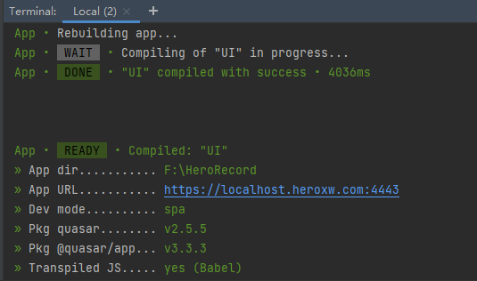

# 快速创建一个DVA APP（Quasar）

## 使用Quasar创建一个SPA应用


您的设备中应当安装Node.js，且版本号≥12.22.1，npm≥6.14.12



\*\*不要使用非偶数的Node版本，例如11，13，15等等。\*\*这些版本没有用Quasar进行测试，并且由于它们的实验性质，经常会引起问题。我们强烈建议始终使用Node的LTS版本。


全局安装 quasar cli

```
$ yarn global add @quasar/cli
# 或者
$ npm install -g @quasar/cli
## 您在中国大陆可能会遇到无法安装的问题，请尝试使用cnpm或更换yarn/npm为国内源。
```

如果您使用yarn安装，请确保 Yarn的 [全局安装位置](https://yarnpkg.com/lang/en/docs/cli/global/) 在你的环境变量（PATH）中：

```bash
# in ~/.bashrc or equivalent
export PATH="$(yarn global bin):$PATH"

# for fish-shell:
set -U fish_user_paths (yarn global bin) $fish_user_paths
```

在Windows下，修改用户的PATH环境变量。如果使用yarn，则添加`%LOCALAPPDATA%\yarn\bin`，否则，如果使用npm，则添加`%APPDATA%\npm`。


进入您的工程文件夹，创建一个名为\<dvaapp>的Quasar项目

```
quasar create dvaapp
```


您在安装的过程中，遇到axios的选项，请必须勾选！



您在中国大陆可能会遇到输入 quasar create 命令后无法正常安装quasar脚手架的问题。您可以通过修改hosts文件的方式加速对github的访问，从而使得quasar create命令可以正常执行。

[https://gitee.com/ineo6/hosts](https://gitee.com/ineo6/hosts)此项目提供了github的最新hosts。在您修改完hosts后，应当立刻在命令行中刷新dns解析，从而使hosts生效。


您可以使用以下命令来调试和打包Quasar项目

```
quasar dev // 在线调试网页
quasar build // 打包发布网页

```

## 配置本地HTTPS

我们为开发者提供了全套的本地HTTPS协议调试服务。

### -下载证书和私钥

您可以从[https://gitee.com/ronghuogame/dva-js/tree/master/ssl](https://gitee.com/ronghuogame/dva-js/tree/master/ssl) 处获得最新的SSL证书和私钥。证书的域名为：`localhost.heroxw.com` 。在`/src/boot/` 中新建文件夹 `ssl` ，将k.key和k.pem下载至`ssl` 中。

.png>)

### -修改 quasar.conf.js 配置文件

首先需要在 quasar.conf.js 文件的开头添加 fs 和 path的支持：

```javascript
const fs = require('fs')
const path = require("path")
```

之后，找到变量 `devServer` ，修改为：

```javascript
// Full list of options: https://quasar.dev/quasar-cli/quasar-conf-js#Property%3A-devServer
    devServer: {
      https: {
        cert: fs.readFileSync(path.join(__dirname, "/src/boot/ssl/k.pem")),
        key: fs.readFileSync(path.join(__dirname, "/src/boot/ssl/k.key"))
      },
      server: {
        type: "https",
      },
      port: 4443,  // 端口可以自定义
      host: "localhost.heroxw.com",  // 这个不能更改
      open: true, // opens browser window automatically
    },
```

保存之后，运行`qusar dev` 。

.png>)


域名localhost.heroxw.com的解析地址为127.0.0.1，若您在开发过程中遇到无法访问此地址的情况，请检查代理或VPN是否关闭，或请勿对127.0.0.1使用代理。佛足额可能会造成 ERR\_CONNECTION\_CLOSED 等报错。


## 导入 DVA SDK

### -将 dva.js 复制到项目目录

您可以在[https://gitee.com/ronghuogame/dva-js](https://gitee.com/ronghuogame/dva-js) 处获得最新的release。将dva.js复制到Quasar项目目录的：src/boot/ 下即可。

.png>)

### -修改 quasar.conf.js 配置文件

修改该文件的 boot 变量，在数组中添加 "dva"。

```
boot: ["axios", "dva"],
```

## 使用 DVA SDK

### -注册产品

在导入DVA SDK后，您可以在项目的任意位置调用SDK了。下面我们从注册产品开始熟悉SDK的使用。

注册产品的目的是验证您的开发者身份和产品身份。开发者表示您是以为经过英雄小屋官方审核的第三方开发者，您拥有可以在英雄小屋客户端和APP发布工具的权限。产品则是您开发的具体应用。

当用户在英雄小屋启动您的应用后，您的应用需要主动地和客户端进行连接。这一过程主要基于sombra协议完成。客户端在识别您的应用合法后，便会将其添加至白名单。后续用户便可以正常使用了。

我们推荐在Vue生命周期的 `created` 时执行以下代码。

> 您项目本地启动的URL应当为：
>
> https://localhost.heroxw.com:4443/?ClientId=32位机器码
>
> 您项目发布后，自英雄小屋客户端启动的URL为：
>
> https://dvaapp.heroxw.com/PRODUCTION\_ID/?ClientId=32位机器码
>
> 机器码是表示主机身份的一串字符串，由客户端提供。



```javascript
// quasar已经全局地将dva sdk导入，只需要调用 this.$dva 就可以访问SDK
this.$dva.developer.developer_id = "YOUR DEVELOPER ID"
this.$dva.developer.production_id = "YOUR PRODUCTION ID"
this.$dva.developer.access_token = "YOUR ACCESS TOKEN"
this.$dva.developer.reg()    // 发起注册
    .then((result) => {
        console.log(resule)    // 注册成功，产品可以正常使用
        // Your Code
    })
```



在以上前端代码中，您需要对`developer_id` 、 `production_id` 和 `access_token` 三个变量赋值。其中，`developer_id` 为您的开发者ID，用于表示您是合法的英雄小屋开发者；`production_id` 为产品ID，用于唯一地表示此产品。`developer_id` 的格式需为 `com.heroxw.*` 。**这两个变量您均可以在开发者中心找到**。

变量 `access_token` 为官方接口颁发的一串鉴权token。您需要请求 `DVA API` 中的接口来获得这一变量。这意味着您的服务必须要有后端。若您没有维护独立后端服务的条件，可以选择英雄小屋的官方 云代理。

&#x20;\* 后端接口：获取access\_token







### -读取系统信息


### -设置和读取超对象（Super Obj）

超对象 `Super Obj` 是英雄小屋官方


### -设置和读取云变量（Cloud Var）


